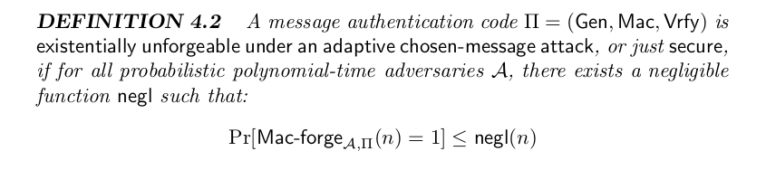
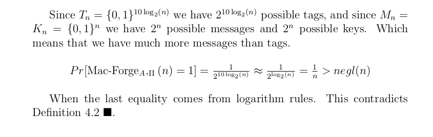
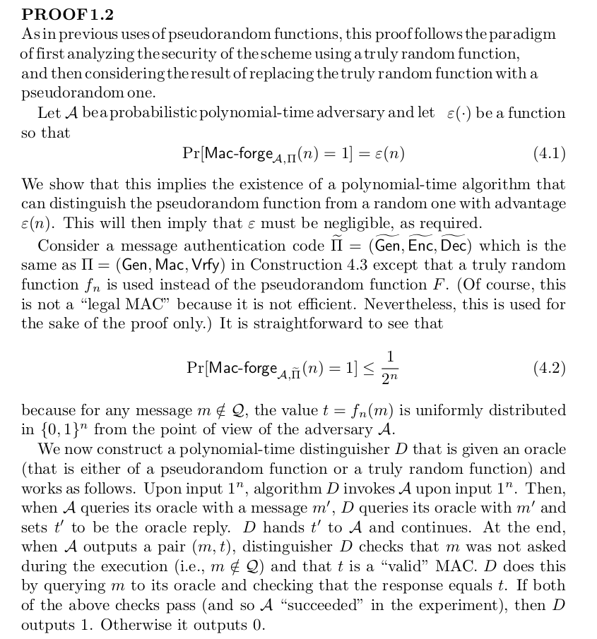
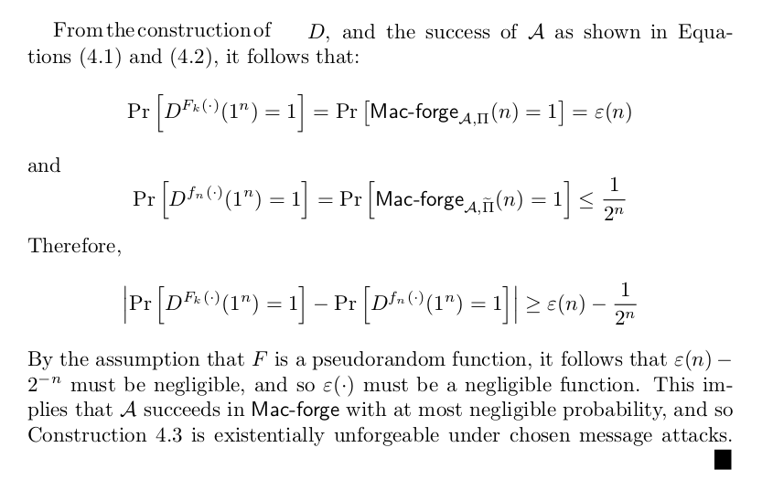

# Crypto lab - Task 3
SEED Labs - RSA Public-Key Encryption and Signature Lab.

---
### Q1.1

### Q1.2 

### Q2.1 - Running the lab flow

Comlipe lab_flow.c - `gcc lab_flow.c -lcrypto -o lab_flow.out`  
Run - `./lab_flow.out`

### Q2.2 - Generate random key

This will generate a very big random **prime** number as a key.      
Usage: `python generateRandomKey.py <numberOfBits>`

---
### Output for Q2.1 & Q2.2
Output file can be found [here](output.txt)